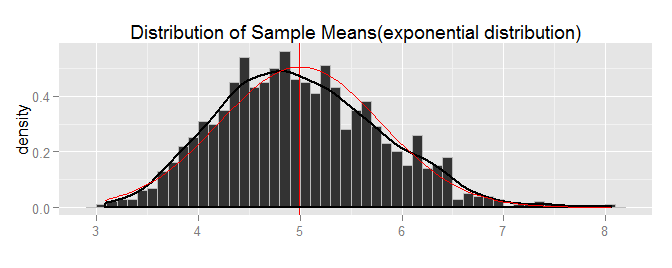

# Statistical Inference Course Project, Part 1: Simulation Exercises
Qingcheng  
Monday, August 25, 2014  

Couresra-[Statistical Inference][statinference-008][Course Project][Part 1]

## Environment
All code was developed and tested on:

> * R version 3.1.1 (2014-07-10) -- "Sock it to Me"
> * Platform: i386-w64-mingw32/i386 (32-bit)
> * Operating System: Microsoft Windows 7 Version 6.1 (Build 7601: Service Pack 1)

## Introduction and Motivation
This is the part 1 of project for the statistical inference class in [Coursera][1]. 

The exponential distribution can be simulated in R with `rexp(n, lambda)` where `lambda` is the rate parameter. The mean of exponential distribution is `1/lambda` and the standard deviation is also also `1/lambda`. Set `lambda = 0.2` for all of the simulations. In this simulation, I need to investigate the distribution of averages of 40 `exponential(0.2)s`. Note that do a thousand or so simulated averages of 40 exponentials.

Illustrate via simulation and associated explanatory text the properties of the distribution of the mean of 40 `exponential(0.2)s`.  I need to:

1. Show where the distribution is centered at and compare it to the theoretical center of the distribution.
2. Show how variable it is and compare it to the theoretical variance of the distribution.
3. Show that the distribution is approximately normal.
4. Evaluate the coverage of the confidence interval for `1/lambda`: $\bar X \pm 1.96 \frac{S}{\sqrt{n}}$ (This only needs to be done for the specific value of `lambda`). 

## Simulation Analysis

The code to simulate the mean of exponential distribution is as follows:

```r
set.seed(1)
lambda <- 0.2
ture_mean <- 1/lambda
ture_std <- 1/lambda
sim_num <- 1000
sample_size <- 40
sample_data <- matrix(rexp(sim_num*sample_size, lambda), sim_num, sample_size)
sample_mean <- apply(sample_data, 1, mean)
sample_var <- apply(sample_data, 1, var)
sample_std <- apply(sample_data, 1, sd)
```

#### 1. Distribution of Sample Means  
The histogram of the sample means shows that they are centered around the theoretical mean of 5 (The mean of origin exponential distribution). (see Law of Large Numbers)

 

#### 2.  Variance of Sample Means
Theoretically, the standard deviation of sample means is $(1/\lambda)/\sqrt{n} = 1/0.2/\sqrt{40}$ = 0.7906, the variance is 0.625. And the variance of sample means we obtained is 0.6177.
We plot the density of the normal distribution (red line) which sample means should follow,  from which we can see two density quite close. 


#### 3.  Distribution is approximately normal
The expected normal distribution (red line) and density of sample means (black line) is quite nearly in the first figure. (see The Central Limit Theorem)


#### 4. Evaluate the coverage of the confidence interval for 1/lambda
Finally, we calculate the 95% confidence interval for our 1000 sample means, and show that what percentage of these confidence intervals contain the true population mean `1/lambda=5`.

```r
LambdaCover<-function(lambda) {
  lower_limit <- sample_mean - 1.96*sample_std/sqrt(sample_size)
  upper_limit <- sample_mean + 1.96*sample_std/sqrt(sample_size)
  mean(lower_limit < 1/lambda & upper_limit > 1/lambda)
}  
LambdaCover(lambda)
```

```
## [1] 0.932
```
Therefore, 93.2% of these confidence intervals contain the true population mean `1/lambda=5`.


## Appendix
The complete R markdown file for this report can be found at the github repo: [Coursera_StatisticalInference][2].

Your comments and questions are welcome. [xiang_lqc@126.com]

*Far over the Misty Mountains rise*  
*Our kingdom a distant light*  
*Leave us standing upon the heights*  
*What was before, we see once more*  
---------------[Song of the Lonely Mountain][3]

[1]:https://www.coursera.org/course/statinference
[2]:https://github.com/uhuruqingcheng/Coursera_StatisticalInference
[3]:https://en.wikipedia.org/wiki/Song_of_the_Lonely_Mountain
