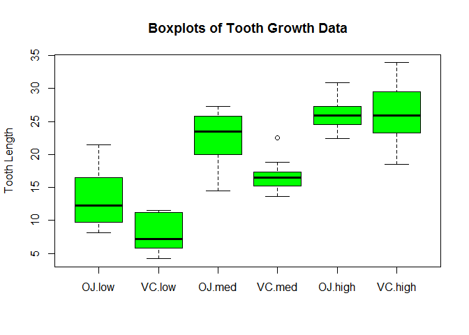

# Statistical Inference Course Project, Part 2: Basic inferential data analysis
Qingcheng  
Tuesday, August 26, 2014  

Couresra-[Statistical Inference][statinference-008][Course Project][Part 2]

## Environment
All code was developed and tested on:

> * R version 3.1.1 (2014-07-10) -- "Sock it to Me"
> * Platform: i386-w64-mingw32/i386 (32-bit)
> * Operating System: Microsoft Windows 7 Version 6.1 (Build 7601: Service Pack 1)

## Introduction and Motivation
This is the part 2 of project for the statistical inference class in [Coursera][1].

In the second portion of the class, we're going to analyze the ToothGrowth data in the R datasets package. 

1. Load the ToothGrowth data and perform some basic exploratory data analyses 
2. Provide a basic summary of the data.
3. Use confidence intervals and hypothesis tests to compare tooth growth by supp and dose. (Use the techniques from class even if there's other approaches worth considering)
4. State your conclusions and the assumptions needed for your conclusions. 


## Data analysis

#### 1. Load data and some basic exploratory data analyses
In this project, we will analyze the effect of Vitamin C on tooth growth in guinea pigs,  the datasets come from the `ToothGrowth` data in the R `datasets` package. By discription in help contents, we konw that the response is the length of teeth(*len*) in each of 10 guinea pigs at each of three dose levels(*dose*) of Vitamin C (0.5, 1, and 2 mg) with each of two delivery methods(orange juice *"OJ"* or ascorbic acid *"VC"*)(*supp*), and totally contains 60 observations. Borrowed from [FACTORIAL BETWEEN SUBJECTS ANOVA][4], we plot the boxplots to summarize graphically.


```r
library(datasets)
data(ToothGrowth)
str(ToothGrowth)
```

```
## 'data.frame':	60 obs. of  3 variables:
##  $ len : num  4.2 11.5 7.3 5.8 6.4 10 11.2 11.2 5.2 7 ...
##  $ supp: Factor w/ 2 levels "OJ","VC": 2 2 2 2 2 2 2 2 2 2 ...
##  $ dose: num  0.5 0.5 0.5 0.5 0.5 0.5 0.5 0.5 0.5 0.5 ...
```

```r
ToothGrowth$dose = factor(ToothGrowth$dose, levels=c(0.5,1.0,2.0), 
                          labels=c("low","med","high"))
replications(len ~ supp * dose, data=ToothGrowth)
```

```
##      supp      dose supp:dose 
##        30        20        10
```

```r
boxplot(len ~ supp * dose, data=ToothGrowth, col="green",
        ylab="Tooth Length", main="Boxplots of Tooth Growth Data")
```

 

#### 2. Summary of the data
From the summary of the data follow, we may have a hypothesis that in both levels of Vitamin C, dosage types **OJ** compare with **VC** result in more tooth growth.

```r
with(ToothGrowth, tapply(len, list(supp,dose), mean))
```

```
##      low   med  high
## OJ 13.23 22.70 26.06
## VC  7.98 16.77 26.14
```

```r
with(ToothGrowth, tapply(len, list(supp,dose), var))
```

```
##       low    med   high
## OJ 19.889 15.296  7.049
## VC  7.544  6.327 23.018
```

#### 3. Statistical inference and analysis
As the sizes of data are small(only 60 observations), we perform to use t-confidence intervals. For each levels of Vitamin C, we will compare across the two dosage types. We assume that **OJ** > **VC**.

```r
TG_OJ_low <- ToothGrowth[ToothGrowth$supp=="OJ" & ToothGrowth$dose=="low",1]
TG_VC_low <- ToothGrowth[ToothGrowth$supp=="VC" & ToothGrowth$dose=="low",1]
t.test(TG_OJ_low, TG_VC_low, alternative="greater")
```

```
## 
## 	Welch Two Sample t-test
## 
## data:  TG_OJ_low and TG_VC_low
## t = 3.17, df = 14.97, p-value = 0.003179
## alternative hypothesis: true difference in means is greater than 0
## 95 percent confidence interval:
##  2.346   Inf
## sample estimates:
## mean of x mean of y 
##     13.23      7.98
```

So for dose **low level** of Vitamin C(0.5 mg), there is strong evidence that **OJ** dosage type result in larger tooth growth than **VC** dosage type.


```r
TG_OJ_med <- ToothGrowth[ToothGrowth$supp=="OJ" & ToothGrowth$dose=="med",1]
TG_VC_med <- ToothGrowth[ToothGrowth$supp=="VC" & ToothGrowth$dose=="med",1]
t.test(TG_OJ_med, TG_VC_med, alternative="greater")
```

```
## 
## 	Welch Two Sample t-test
## 
## data:  TG_OJ_med and TG_VC_med
## t = 4.033, df = 15.36, p-value = 0.0005192
## alternative hypothesis: true difference in means is greater than 0
## 95 percent confidence interval:
##  3.356   Inf
## sample estimates:
## mean of x mean of y 
##     22.70     16.77
```

For dose **medium level** of Vitamin C(1 mg), there is also evidence that **OJ** dosage type result in larger tooth growth than **VC** dosage type.


```r
TG_OJ_high <- ToothGrowth[ToothGrowth$supp=="OJ" & ToothGrowth$dose=="high",1]
TG_VC_high <- ToothGrowth[ToothGrowth$supp=="VC" & ToothGrowth$dose=="high",1]
t.test(TG_OJ_high, TG_VC_high, alternative="greater")
```

```
## 
## 	Welch Two Sample t-test
## 
## data:  TG_OJ_high and TG_VC_high
## t = -0.0461, df = 14.04, p-value = 0.5181
## alternative hypothesis: true difference in means is greater than 0
## 95 percent confidence interval:
##  -3.133    Inf
## sample estimates:
## mean of x mean of y 
##     26.06     26.14
```

```r
t.test(TG_OJ_high, TG_VC_high, alternative="two.sided")
```

```
## 
## 	Welch Two Sample t-test
## 
## data:  TG_OJ_high and TG_VC_high
## t = -0.0461, df = 14.04, p-value = 0.9639
## alternative hypothesis: true difference in means is not equal to 0
## 95 percent confidence interval:
##  -3.798  3.638
## sample estimates:
## mean of x mean of y 
##     26.06     26.14
```

However, for dosage levels of **high level**(2 mg), we cannot say that there is any statistical difference in tooth growth between the **OJ** and **VC** dosage types.

#### 4. Conclusions 
With 95% confidence, when the dosage levels is low and medium(0.5 and 1 mg), **OJ** dosage type result in larger tooth growth than **VC** dosage type. However, when the dosage levels is high(2 mg), there isn't statistical difference in tooth growth between two dosage types.


## Appendix
The complete R markdown file for this report can be found at the github repo: [Coursera_StatisticalInference][2].

Your comments and questions are welcome. [xiang_lqc@126.com]

*Fiery mountain beneath the moon*  
*The words unspoken, we’ll be there soon*  
*For home a song that echoes on*  
*And all who find us will know the tune*  
---------------[Song of the Lonely Mountain][3]

[1]:https://www.coursera.org/course/statinference
[2]:https://github.com/uhuruqingcheng/Coursera_StatisticalInference
[3]:https://en.wikipedia.org/wiki/Song_of_the_Lonely_Mountain
[4]:http://ww2.coastal.edu/kingw/statistics/R-tutorials/factorial.html
